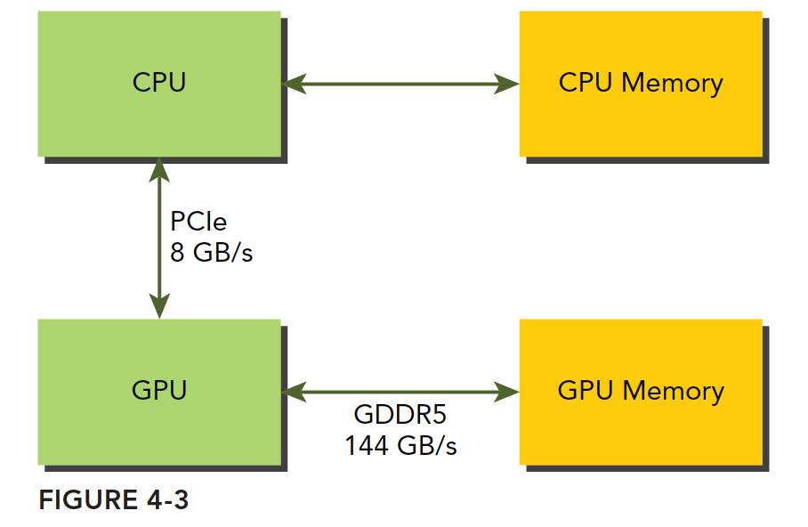
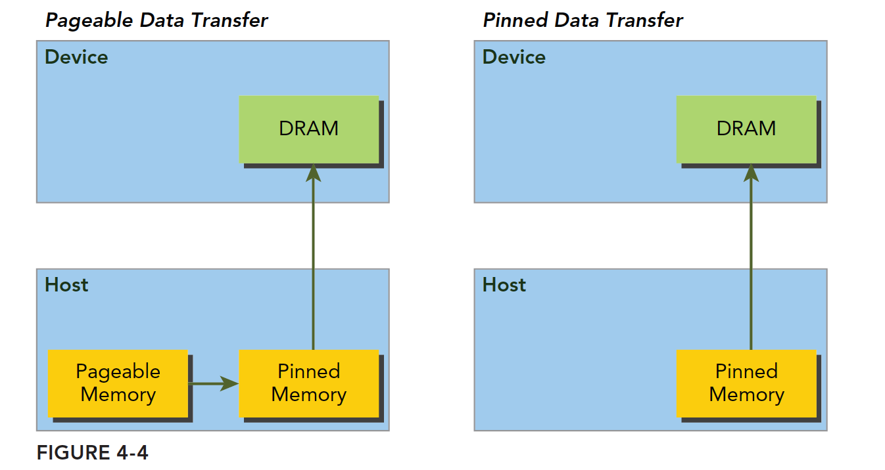

# CUDA Notes

## 框架

## api

## SIMD和SIMT的区别

- simd：单指令多数据的执行属于向量机，比如我们有四个数字要加上四个数字，那么我们可以用这种单指令多数据的指令来一次完成本来要做四次的运算。这种机制的问题就是过于死板，不允许每个分支有不同的操作，所有分支必须同时执行相同的指令，必须执行没有例外。
- simt；相比之下单指令多线程SIMT就更加灵活了，虽然两者都是将相同指令广播给多个执行单元，但是SIMT的某些线程可以选择不执行，也就是说同一时刻所有线程被分配给相同的指令，SIMD规定所有人必须执行，而SIMT则规定有些人可以根据需要不执行，这样SIMT就保证了线程级别的并行，而SIMD更像是指令级别的并行。
### SIMT包括以下SIMD不具有的关键特性
1. 每个线程都有自己的指令地址计数器
2. 每个线程都有自己的寄存器状态
3. 每个线程可以有一个独立的执行路径

## 内存结构

### 常量内存
一次读取会广播给所有线程束内的线程
### 纹理内存
纹理内存驻留在设备内存中
### 全局内存
全局内存对应于设备内存，一个是逻辑表示，一个是硬件表示
### GPU缓存
与CPU缓存类似，GPU缓存不可编程，其行为出厂是时已经设定好了。GPU上有4种缓存：1. 一级缓存, 2. 二级缓存, 3. 只读常量缓存, 4. 只读纹理缓存。与CPU不同的是，CPU读写过程都有可能被缓存，但是GPU写的过程不被缓存，只有加载会被缓存！

变量申明总结：
|修饰符|变量名称|存储器|作用域|生命周期|
|-|-|-|-|-|-|
|float var|寄存器|线程|线程|
|float var[100]|本地|线程|线程|
|__share__|float var*|共享|块|块|
|__device__|float var*|全局|全局|应用程序|
|__constant	float var*|常量|全局|应用程序|

设备存储器的重要特征：
|存储器|片上/片外|缓存|存取|范围|生命周期|
|-|-|-|-|-|-|
|寄存器|片上|n/a|R/W|一个线程|线程|
|本地|片外|1.0以上有|R/W|一个线程|线程|
|共享|片上|n/a|R/W|块内所有线程|块|
|全局|片外|1.0以上有|R/W|所有线程+主机|主机配置|
|常量|片外|Yes|R|所有线程+主机|主机配置|
|纹理|片外|Yes|R|所有线程+主机|主机配置|

### gpu和cpu之间的数据交换

### 固定内存
主机内存采用分页式管理，通俗的说法就是操作系统把物理内存分成一些“页”，然后给一个应用程序一大块内存，但是这一大块内存可能在一些不连续的页上，应用只能看到虚拟的内存地址，而操作系统可能随时更换物理地址的页（从原始地址复制到另一个地址）但是应用是不会差觉得，但是从主机传输到设备上的时候，如果此时发生了页面移动，对于传输操作来说是致命的，所以在数据传输之前，CUDA驱动会锁定页面，或者直接分配固定的主机内存，将主机源数据复制到固定内存上，然后从固定内存传输数据到设备上。

**结论**：
固定内存的释放和分配成本比可分页内存要高很多，但是传输速度更快，所以对于大规模数据，固定内存效率更高