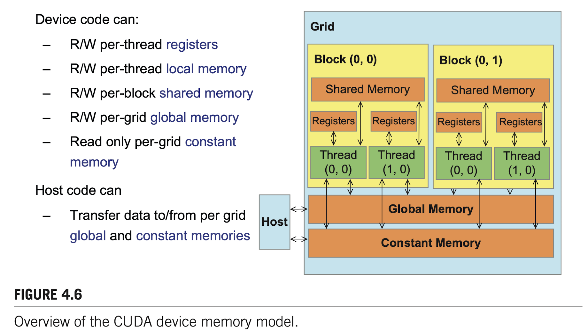
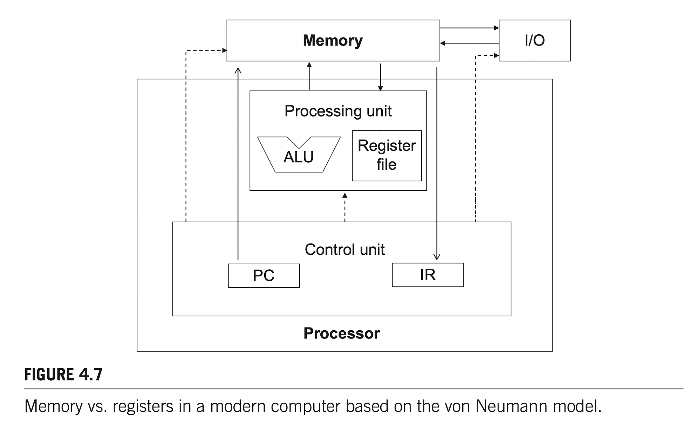
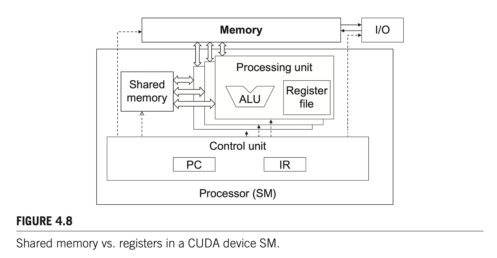
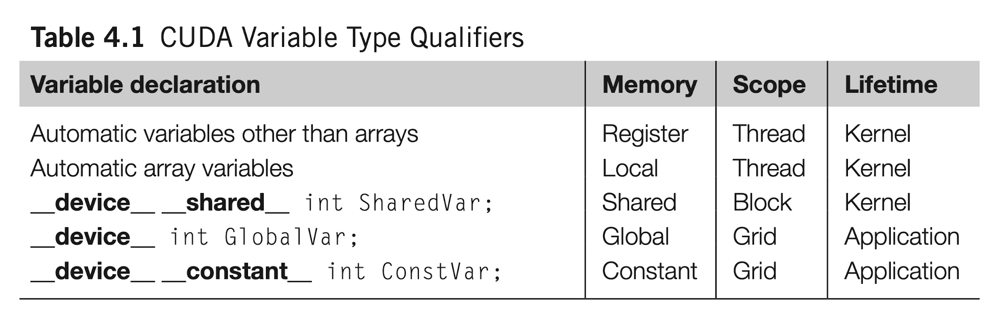

# CUDA shared Memory and Matrix Mulplication

## CUDA内存模型
CUDA内存模型如下图所示：


其中的``shared memory``为一个``Block``内的所有线程共享，并且可以在代码中通过``__shared__``关键字进行定义，其作用相当于可由程序员控制的高速缓存(``cache``)。寄存器``Registers``由单个线程独有，**并且每个线程拥有的寄存器数量是根据``Block``的大小进行分配的**。简单来说，一个``SM``上有很多的线程以及很多寄存器，但是一个``SM``上能定义的``Block``是有限的。举个例子，假设一个``SM``上总共有1024个``CUDA CORES``(thread)，其上最多能分配16个``grid``，那么在指定``kernel``的纬度时，设置一个``grid``包含16个线程。那么这一个``SM``上只有16*16=256个``CUDA CORES``是工作的，其他剩下的都是闲置的，这会造成gpu的利用率不高。寄存器的分配也是同理，如果分配的线程少，每个线程包含的寄存器就更多，反之则更少。

``CUDA``设备的内存类型一共分为以下几种，**全局内存(global memory)**，**常量内存(constant memory)**，**寄存器(registers)**和**共享内存(share memory)**。一般来说，现代处理器基本都符合冯诺依曼架构，英伟达的GPU也不例外，其结构如下图所示：

其中**全局内存(global memory)**对应于其中的**Memory Box**并且位于处理单元之外，相当于如今的**DRAM**，它的特点是容量大，延迟高。**Register**对应于其中的**Register Box**，它和**shared memory**一同位于处理芯片之上，他们的特点是数量少，延迟低。通常前者的读取速度和后者相差两个数量级。CUDA设备中一个``SM``的结构如下图所示：


这是一个典型的**SIMD (Single Instruction Multiple Data)** 设计，一个``SM``中有多个``Processing Unit``，每一个单元运行一个线程，并且多个线程共用同一个``shared memory``。``PC``和``IR``表示需要执行的指令，并在所有的处理单元中运行。

下图表示CUDA中变量的类型：


``shared memory``和``register``是**CUDA**设备中较为稀缺的资源，合理使用他们这些资源显得尤为重要。在一个**SM**中，包含一定数量的线程和寄存器，假设为1536个线程以及16384个寄存器。假设所有线程并发运行，那么每个线程中只有**16384/1536=10**个寄存器。如果在一个线程中使用到了11个寄存器，那么并发运行的线程就会减少(即少于1536的并发)，并且会以``Block``为颗粒度降低运行效率。假设一个``block``包含512个线程，那么一次性会减少512个线程的并发量。因此下一次程序执行的时候，只有1024个线程并发运行，减少了1/3。``share memory``同理。

在使用``share memory``时，可以在运行时动态决定每个``kernel``使用的大小，增加灵活度。可通过增加``extern``来实现这个功能，并且这是一维的线性数组。
```c++
extern __shared__ float Mds[];
extern __shared__ float Nds[];
```
在调用``kernel``时，通过第三个参数来指定其大小。
```c++
size_t size=
      calculate_appropriate_SM_usage(dev_prop.sharedMemPerBlock,...);
matrixMulKernel<<<dimGrid, dimBlock, size>>>(Md, Nd, Pd, Width);
```


## MatrixSum 示例

```c++{.javascript .numberLines .lineAnchors}
// d_P中一个点用一个线程进行计算，一个block内正好包含TILE_WIDTH*TILE_WIDTH个线程。
__global__ void MatrixMulKernel(float* d_M, float* d_N, float* d_P, int Width)
{
    __shared__ float Mds[TILE_WIDTH][TILE_WIDTH];
    __shared__ float Nds[TILE_WIDTH][TILE_WIDTH];

    // 表示d_P中线程的索引
    int bx = blockIdx.x;
    int by = blockIdx.y;
    int tx = threadIdx.x;
    int ty = threadIdx.y;

    // Identity the row and column of the d_P element to work on
    int Row = by * TILE_WIDTH + ty;
    int Col = bx * TILE_WIDTH + tx;

    float Pvalue = 0;
    for (int ph = 0; ph < Width / TILE_WIDTH; ++ph) {
        // Collaborative loading of d_M abd d_N tiles into shared memory
        Mds[ty][tx] = d_M[Row*Width + ph*TILE_WIDTH + tx];
        Nds[ty][tx] = d_N[(ph*TILE_WIDTH + ty) * Width + Col];
        __syncthreads();
        for (int k = 0; k < TILE_WIDTH; ++k) {
            Pvalue += Mds[ty][k] * Nds[k][tx];
        }
        __syncthreads();
    }
    d_P[Row * Width + Col] = Pvalue;
}
```