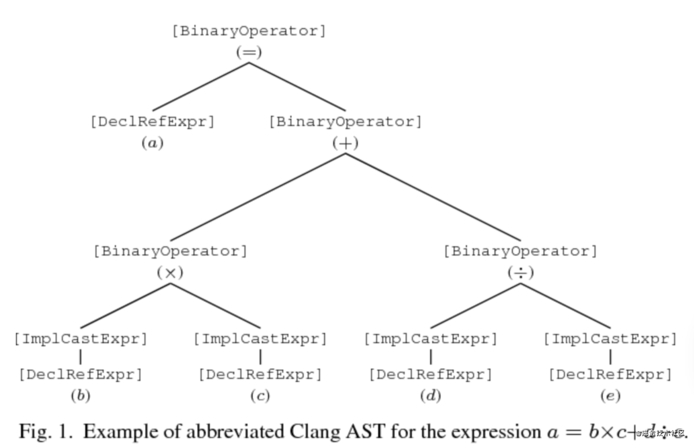

# LLVM cheatsheet
llvm工具链使用说明

## 编译器
最受欢迎的传统静态编译器设计主要是由三部分构成，分别是前端(front end)，优化器(optimizer)和后端(back end)。前端解析源码，检查语法错误，并生成语言特定的抽象语法树(AST)表示输入的代码。抽象语法树会被转换成一种新的中间展示(ir)，方便编译器进行优化。后端会根据目标机器生成最终的可以运行的二进制机器码。其示意图如下所示。


当编译器需要支持多种语言时，这种经典的解耦设计发挥了它最大的优势。如果编译器在优化器中使用一种通用的代码展示，那么只需写一个可以编译语言的前端，以及在不同平台写一个后端，提高了组件的通用性。其表示如下图所示：


LLVM项目是模块化和可重用的编译器及工具链技术的集合。名称``LLVM``是``Low Level Virtual Machine``的缩写，但是他现在和传统虚拟机并没有什么关系，只是``LLVM``的全名。LLVM最重要的设计时中间表示``LLVM Intermediate Representation(IR)``，它是编译器中表示代码的一种形式。优化器使用``LLVM IR``作中间的转换与分析处理。``LLVM IR``本身就是具有良好语义定义的一流语言。

``LLVM IR``是前端输出，后端的输入：


## Clang 编译过程
以一个``test.cpp``文件为例，代码如下：
```cpp
#include <stdio.h>

int main()
{
    printf("You are my sunshine");
}
```

可以通过以下命令，查看使用``clang``编译的几个不同阶段。
```bash
clang -ccc-print-phases test.c
```

其输出如下所示：
```bash
               +- 0: input, "test.cpp", c++
            +- 1: preprocessor, {0}, c++-cpp-output
         +- 2: compiler, {1}, ir
      +- 3: backend, {2}, assembler
   +- 4: assembler, {3}, object
+- 5: linker, {4}, image
6: bind-arch, "arm64", {5}, image
```
接下来，基于这个例子，通过使用``llvm``工具链，逐步完成整个编译过程。
### 预处理
基于输入，通过预处理执行一系列的文本转换与文本处理。预处理时在整整的编译开始之前由编译器调用的独立程序。
```bash
clang -E test.cpp -o test.ii
```
其中命令``-E``表示运行预处理，``-o``后面跟输出文件名。下面是``test.ii``的片段
```c++
# 1 "test.cpp"
# 1 "<built-in>" 1
# 1 "<built-in>" 3
# 414 "<built-in>" 3
# 1 "<command line>" 1
# 1 "<built-in>" 2
# 1 "test.cpp" 2
# 1 "/Library/Developer/CommandLineTools/SDKs/MacOSX.sdk/usr/include/c++/v1/stdio.h" 1 3
# 101 "/Library/Developer/CommandLineTools/SDKs/MacOSX.sdk/usr/include/c++/v1/stdio.h" 3

···


extern "C" {
extern const int sys_nerr;
extern const char *const sys_errlist[];
int asprintf(char ** , const char * , ...) __attribute__((__format__ (__printf__, 2, 3)));
char *ctermid_r(char *);
char *fgetln(FILE *, size_t *);
const char *fmtcheck(const char *, const char *);
int fpurge(FILE *);
void setbuffer(FILE *, char *, int);
int setlinebuf(FILE *);
int vasprintf(char ** , const char * , va_list) __attribute__((__format__ (__printf__, 2, 0)));

FILE *funopen(const void *,
                 int (* _Nullable)(void *, char *, int),
                 int (* _Nullable)(void *, const char *, int),
                 fpos_t (* _Nullable)(void *, fpos_t, int),
                 int (* _Nullable)(void *));
}
# 108 "/Library/Developer/CommandLineTools/SDKs/MacOSX.sdk/usr/include/c++/v1/stdio.h" 2 3
# 2 "test.cpp" 2
int main()
{
    printf("You are my sunshine");
}
```
其中``.c``输出``.i``文件，``.cpp``输出``.ii``文件。

预处理的任务主要有以下几点：
- 将输入文件读到内存，并断行；
- 替换注释为单个空格；
- ``Tokenization``将输入转换为一系列预处理``Tokens``;
- 处理``#include``所引入的库，以递归的方式，插入到``#include``所在的位置;
- 替换宏定义;
- 条件编译，根据条件包括或者排除程序代码的某些部分;
- 插入行标记;

在预处理的输出中，源文件名和行号信息会以``# linenum filename flags``形式传递，这被称为行标记，代表接下来的内容开始于源文件``filename``的第``linenum``行，而``flags``则会有``0``或者多个，有``1``,``2``,``3``,``4``；如果有多个``flags``时，彼此使用分号隔开。详见[此处](http://tigcc.ticalc.org/doc/cpp.html#SEC41)。

每个标识的标识内容如下：

- ``1``表示一个新文件的开始
- ``2``表示返回文件（包含另一个文件后）
- ``3``表示以下文本来自系统头文件，因此应禁止某些警告
- ``4``表示应将以下文本视为包装在隐式``extern "c"``块中。

### 词法分析
词法分析属于预处理部分，词法分析的整个过程，主要是按照：标识符、数字、字符串文字、标点符号，将代码分成许多字符串序列，其中每个元素称之为``Token``，整个过程称为``Tokenization``。命令如下所示：
```bash
clang -fmodules -fsyntax-only -Xclang -dump-tokens test.cpp
```

其中每个选项的含义:
- ``-fmodules``：启用``modules``语言功能。关于``Modules``特性，详见[此处](https://clang.llvm.org/docs/Modules.html#introduction)，大意为使用``import``代替``include``，编译速度更快。
- ``-fsyntax-only``：运行预处理器，解析器和类型检查阶段。
- ``-Xclang <arg>``：传递参数到``clang``的编译器。
- ``-dump-tokens``：运行预处理器，转储``Token``的内部表示。
更多关于``Clang``参数的描述，详见[此处](https://gist.githubusercontent.com/masuidrive/5231110/raw/db6ddfb4fdad174f99cbfefd38367223d491ca18/gistfile1.txt)。

其输出片段如下：
```c++
comma ','               Loc=</Library/Developer/CommandLineTools/SDKs/MacOSX.sdk/usr/include/stdio.h:378:62>
identifier 'fpos_t'      [StartOfLine] [LeadingSpace]   Loc=</Library/Developer/CommandLineTools/SDKs/MacOSX.sdk/usr/include/stdio.h:379:18>
l_paren '('      [LeadingSpace] Loc=</Library/Developer/CommandLineTools/SDKs/MacOSX.sdk/usr/include/stdio.h:379:25>
star '*'                Loc=</Library/Developer/CommandLineTools/SDKs/MacOSX.sdk/usr/include/stdio.h:379:26>
_Nullable '_Nullable'    [LeadingSpace] Loc=</Library/Developer/CommandLineTools/SDKs/MacOSX.sdk/usr/include/stdio.h:379:28>
r_paren ')'             Loc=</Library/Developer/CommandLineTools/SDKs/MacOSX.sdk/usr/include/stdio.h:379:37>
l_paren '('             Loc=</Library/Developer/CommandLineTools/SDKs/MacOSX.sdk/usr/include/stdio.h:379:38>
void 'void'             Loc=</Library/Developer/CommandLineTools/SDKs/MacOSX.sdk/usr/include/stdio.h:379:39>
star '*'         [LeadingSpace] Loc=</Library/Developer/CommandLineTools/SDKs/MacOSX.sdk/usr/include/stdio.h:379:44>
comma ','               Loc=</Library/Developer/CommandLineTools/SDKs/MacOSX.sdk/usr/include/stdio.h:379:45>
identifier 'fpos_t'      [LeadingSpace] Loc=</Library/Developer/CommandLineTools/SDKs/MacOSX.sdk/usr/include/stdio.h:379:47>
comma ','               Loc=</Library/Developer/CommandLineTools/SDKs/MacOSX.sdk/usr/include/stdio.h:379:53>
int 'int'        [LeadingSpace] Loc=</Library/Developer/CommandLineTools/SDKs/MacOSX.sdk/usr/include/stdio.h:379:55>
r_paren ')'             Loc=</Library/Developer/CommandLineTools/SDKs/MacOSX.sdk/usr/include/stdio.h:379:58>
comma ','               Loc=</Library/Developer/CommandLineTools/SDKs/MacOSX.sdk/usr/include/stdio.h:379:59>
int 'int'        [StartOfLine] [LeadingSpace]   Loc=</Library/Developer/CommandLineTools/SDKs/MacOSX.sdk/usr/include/stdio.h:380:18>
l_paren '('      [LeadingSpace] Loc=</Library/Developer/CommandLineTools/SDKs/MacOSX.sdk/usr/include/stdio.h:380:22>
star '*'                Loc=</Library/Developer/CommandLineTools/SDKs/MacOSX.sdk/usr/include/stdio.h:380:23>
_Nullable '_Nullable'    [LeadingSpace] Loc=</Library/Developer/CommandLineTools/SDKs/MacOSX.sdk/usr/include/stdio.h:380:25>
r_paren ')'             Loc=</Library/Developer/CommandLineTools/SDKs/MacOSX.sdk/usr/include/stdio.h:380:34>
l_paren '('             Loc=</Library/Developer/CommandLineTools/SDKs/MacOSX.sdk/usr/include/stdio.h:380:35>
void 'void'             Loc=</Library/Developer/CommandLineTools/SDKs/MacOSX.sdk/usr/include/stdio.h:380:36>
star '*'         [LeadingSpace] Loc=</Library/Developer/CommandLineTools/SDKs/MacOSX.sdk/usr/include/stdio.h:380:41>
r_paren ')'             Loc=</Library/Developer/CommandLineTools/SDKs/MacOSX.sdk/usr/include/stdio.h:380:42>
r_paren ')'             Loc=</Library/Developer/CommandLineTools/SDKs/MacOSX.sdk/usr/include/stdio.h:380:43>
semi ';'                Loc=</Library/Developer/CommandLineTools/SDKs/MacOSX.sdk/usr/include/stdio.h:380:44>
r_brace '}'      [StartOfLine]  Loc=</Library/Developer/CommandLineTools/SDKs/MacOSX.sdk/usr/include/stdio.h:381:1 <Spelling=/Library/Developer/CommandLineTools/SDKs/MacOSX.sdk/usr/include/sys/cdefs.h:72:25>>
int 'int'        [StartOfLine]  Loc=<test.cpp:3:1>
identifier 'main'        [LeadingSpace] Loc=<test.cpp:3:5>
l_paren '('             Loc=<test.cpp:3:9>
r_paren ')'             Loc=<test.cpp:3:10>
l_brace '{'      [StartOfLine]  Loc=<test.cpp:4:1>
identifier 'printf'      [StartOfLine] [LeadingSpace]   Loc=<test.cpp:5:5>
l_paren '('             Loc=<test.cpp:5:11>
string_literal '"You are my sunshine"'          Loc=<test.cpp:5:12>
r_paren ')'             Loc=<test.cpp:5:33>
semi ';'                Loc=<test.cpp:5:34>
r_brace '}'      [StartOfLine]  Loc=<test.cpp:6:1>
eof ''          Loc=<test.cpp:6:2>
```
词法分析中``Token``包含信息（详情见[此处](https://bcain-llvm.readthedocs.io/projects/clang/en/latest/InternalsManual/#the-token-class)）：
- ``Source Location``：表示``Token``开始的位置，比如：``Loc=<test.cpp:3:5>``;
- ``Token Kind``：表示``Token``的类型，比如``identifier``、``numeric_constant``、``string_literal``；
- ``Flags``：词法分析器和处理器跟踪每个``Token``的基础，目前有四个``Flag``分别是：
  - ``StartOfLine``：表示这是每行开始的第一个``Token``；
  - ``LeadingSpace``：当通过宏扩展``Token``时，在``Token``之前有一个空格字符。该标志的定义是依据处理器的字符串话要求而进行的非常严格的定义。
  - ``DisableExtand``：该标志在预处理器内部使用，用来表示``identifier``令牌禁止宏扩展。
  - ``NeedsCleaning``：如果令牌的原始拼写包含三字符组或转义的换行符，则设置此标志。

### 语法分析于语义分析
此阶段对输入文件进行语法分析，将预处理器生成的``Tokens``转换为语法分析树；一旦生成语法分析树后，将会进行语义分析，执行类型检查和代码格式检查。这个阶段负责生成大多数编译器警告以及语法分析过程的错误。最终输出``AST``（抽象语法树）。

``AST``示意图[来源](https://www.semanticscholar.org/paper/Comparison-of-Clang-Abstract-Syntax-Trees-using-Torres-Ludwig/1f8bc56656d03f8a047773ed76b4c3272a0c41ac/figure/0)



命令如下所示：
```bash
clang -fmodules -fsyntax-only -Xclang -ast-dump test.cpp
```
输出片段如下：
```c++
|-LinkageSpecDecl 0x1489d6d78 </Library/Developer/CommandLineTools/SDKs/MacOSX.sdk/usr/include/sys/cdefs.h:71:25, line:72:25> line:71:32 C
| |-VarDecl 0x1489d6de0 </Library/Developer/CommandLineTools/SDKs/MacOSX.sdk/usr/include/stdio.h:360:1, col:20> col:20 sys_nerr 'const int' extern
| |-VarDecl 0x1489d6ed8 <line:361:1, col:42> col:30 sys_errlist 'const char *const[]' extern
| |-FunctionDecl 0x1489d7108 <line:363:1, /Library/Developer/CommandLineTools/SDKs/MacOSX.sdk/usr/include/sys/cdefs.h:398:62> /Library/Developer/CommandLineTools/SDKs/MacOSX.sdk/usr/include/stdio.h:363:6 asprintf 'int (char **, const char *, ...)'
| | |-ParmVarDecl 0x1489d6f58 <col:15, col:21> col:33 'char **'
| | |-ParmVarDecl 0x1489d6fd8 <col:35, col:46> col:58 'const char *'
| | `-FormatAttr 0x1489d71b8 </Library/Developer/CommandLineTools/SDKs/MacOSX.sdk/usr/include/sys/cdefs.h:398:17, col:60> printf 2 3
| |-FunctionDecl 0x1489d72d0 </Library/Developer/CommandLineTools/SDKs/MacOSX.sdk/usr/include/stdio.h:364:1, col:23> col:7 ctermid_r 'char *(char *)'
| | `-ParmVarDecl 0x1489d7238 <col:17, col:22> col:23 'char *'
| |-FunctionDecl 0x1489d8320 <line:365:1, col:30> col:7 fgetln 'char *(FILE *, size_t *)'
| | |-ParmVarDecl 0x1489d7388 <col:14, col:19> col:20 'FILE *'
| | `-ParmVarDecl 0x1489d8200 <col:22, col:29> col:30 'size_t *'
| |-FunctionDecl 0x1489d8540 </Library/Developer/CommandLineTools/SDKs/MacOSX.sdk/usr/include/sys/cdefs.h:116:25, /Library/Developer/CommandLineTools/SDKs/MacOSX.sdk/usr/include/stdio.h:366:50> col:15 fmtcheck 'const char *(const char *, const char *)'
| | |-ParmVarDecl 0x1489d83e8 <col:24, col:35> col:36 'const char *'
| | `-ParmVarDecl 0x1489d8468 <col:38, col:49> col:50 'const char *'
| |-FunctionDecl 0x1489d8698 <line:367:1, col:19> col:6 fpurge 'int (FILE *)'
| | `-ParmVarDecl 0x1489d8600 <col:13, col:18> col:19 'FILE *'
| |-FunctionDecl 0x1489d8978 <line:368:1, col:36> col:7 setbuffer 'void (FILE *, char *, int)'
| | |-ParmVarDecl 0x1489d8750 <col:17, col:22> col:23 'FILE *'
| | |-ParmVarDecl 0x1489d87d0 <col:25, col:30> col:31 'char *'
| | `-ParmVarDecl 0x1489d8850 <col:33> col:36 'int'
| |-FunctionDecl 0x1489d8ad8 <line:369:1, col:23> col:6 setlinebuf 'int (FILE *)'
| | `-ParmVarDecl 0x1489d8a40 <col:17, col:22> col:23 'FILE *'
| |-FunctionDecl 0x1489d8e10 <line:370:1, /Library/Developer/CommandLineTools/SDKs/MacOSX.sdk/usr/include/sys/cdefs.h:398:62> /Library/Developer/CommandLineTools/SDKs/MacOSX.sdk/usr/include/stdio.h:370:6 vasprintf 'int (char **, const char *, va_list)'
| | |-ParmVarDecl 0x1489d8b98 <col:16, col:22> col:34 'char **'
| | |-ParmVarDecl 0x1489d8c18 <col:36, col:47> col:59 'const char *'
| | |-ParmVarDecl 0x1489d8c90 <col:61> col:68 'va_list':'char *'
| | `-FormatAttr 0x1489d8ec8 </Library/Developer/CommandLineTools/SDKs/MacOSX.sdk/usr/include/sys/cdefs.h:398:17, col:60> printf 2 0
| `-FunctionDecl 0x1489d9968 </Library/Developer/CommandLineTools/SDKs/MacOSX.sdk/usr/include/stdio.h:376:1, line:380:43> line:376:7 funopen 'FILE *(const void *, int (* _Nullable)(void *, char *, int), int (* _Nullable)(void *, const char *, int), fpos_t (* _Nullable)(void *, fpos_t, int), int (* _Nullable)(void *))'
|   |-ParmVarDecl 0x1489d8f48 <col:15, col:26> col:27 'const void *'
|   |-ParmVarDecl 0x1489d9200 <line:377:18, col:25> col:34 'int (* _Nullable)(void *, char *, int)':'int (*)(void *, char *, int)'
|   |-ParmVarDecl 0x1489d9468 <line:378:18, col:25> col:34 'int (* _Nullable)(void *, const char *, int)':'int (*)(void *, const char *, int)'
|   |-ParmVarDecl 0x1489d96c0 <line:379:18, col:28> col:37 'fpos_t (* _Nullable)(void *, fpos_t, int)':'fpos_t (*)(void *, fpos_t, int)'
|   `-ParmVarDecl 0x1489d9818 <line:380:18, col:25> col:34 'int (* _Nullable)(void *)':'int (*)(void *)'
`-FunctionDecl 0x1489d9a58 <test.cpp:3:1, line:6:1> line:3:5 main 'int ()'
  `-CompoundStmt 0x1489d9c98 <line:4:1, line:6:1>
    `-CallExpr 0x1489d9c58 <line:5:5, col:33> 'int'
      |-ImplicitCastExpr 0x1489d9c40 <col:5> 'int (*)(const char *, ...)' <FunctionToPointerDecay>
      | `-DeclRefExpr 0x1489d9be8 <col:5> 'int (const char *, ...)' lvalue Function 0x1489c62d8 'printf' 'int (const char *, ...)'
      `-ImplicitCastExpr 0x1489d9c80 <col:12> 'const char *' <ArrayToPointerDecay>
        `-StringLiteral 0x1489d9bb8 <col:12> 'const char[20]' lvalue "You are my sunshine"
```
``clang``的``AST``是从``TranslationUnitDecl``节点开始进行递归遍历的；``AST``中许多重要的``Node``，继承自``Type``，``Decl``，``DeclContext``，``Stmt``；

- ``Type``：表示类型，比如``BuiltinType``；
- ``DeclContext``：表示一个声明``declaration``或者一个定义``definition``，比如：变量，函数，结构体，``typedef``；
- ``DeclContext``：用来声明表示上下文的特定``decl``类型的基类；
- ``Stmt``：表示一条陈述``statement``；
- ``Expr``：在``Clang``的语法数中也表示一条陈述``statements``；
  
### 代码的优化和生成
这个阶段主要任务是将``AST``转换为底层中间的代码``LLVM IR``，并且最终生成机器码；期间负责生成目标框架的代码以及优化生成的代码。最终输出``.s``文件（汇编文件）。

``LLVM IR``有三种格式，并且是等价的：
- 文本格式：``.ll``文件，人类可读的表示。
- 内存中用以优化自身时，执行检查和修改的数据结构（编译过程中载入内存的形式）。
- 磁盘二进制(``BitCode``)格式：``.bc``文件。

``LLVM IR``提供了``.ll``与``.bc``相互转换的工具：
- ``llvm-as``：``.ll``->``.bc``
- ``llvm-dis``：``.bc``->``.ll``

首先使用以下两条``clang``命令，分别生成对应的``LLVM IR``。
```bash
clang -S -emit-llvm test.cpp -o test.ll
```
```bash
clang -emit-llvm -c test.cpp -o test.bc
```
其中的参数分别代表以下含义：
- ``-S``：只运行preprocess以及compilation步骤，并生成汇编文件。
- ``-c``：只运行preprocess, compile和assemble步骤，并生成二进制文件。
- ``-emit-llvm``：生成``LLVM``表示的汇编文件或二进制文件。

相互转换命令：
```bash
llvm-as test.ll -o test.bc
llvm-dis test.bc -o test.ll
```
其中``.ll``的代码片段如下所示
```bash
; ModuleID = 'test.cpp'
source_filename = "test.cpp"
target datalayout = "e-m:o-i64:64-i128:128-n32:64-S128"
target triple = "arm64-apple-macosx12.0.0"

@.str = private unnamed_addr constant [20 x i8] c"You are my sunshine\00", align 1

; Function Attrs: noinline norecurse optnone ssp uwtable
define i32 @main() #0 {
  %1 = call i32 (i8*, ...) @printf(i8* getelementptr inbounds ([20 x i8], [20 x i8]* @.str, i64 0, i64 0))
  ret i32 0
}

declare i32 @printf(i8*, ...) #1
```
### 代码优化
``Clang``代码优化参数有``-O0``、``-O1``、``-O2``、``-O3``、``-Ofast``、``-Os``、``-Og``、``-Oz``、``-O``、``-O4``

- ``-O0``：表示没有优化。
- ``-O1``：优化程度较低。
- ``-O2``：适度的优化水平，实现最优化。
- ``-O3``：与``-O2``相似，不同程度之处在于它优化的时间比较长，可能会生成更大的代码。
- ``-Ofast``：启用``-O3``中的所有优化，并且可能启用一些激进优化。
- ``-Os``：与``-O2``一样，具有额外的优化功能以减少代码大小。
- ``-Oz``：类似于``-Os``，进一步减少了代码大小。
- ``-Og``：类似于``-O1``。
- ``-O``：相当于``-O2``。

### 代码生成
生成目标架构的汇编代码。
其命令和上面的代码很类似，只是取消了``-emit-llvm``选项。
```bash
clang -S test.cpp -o test.s
```
``test.s``文件内容如下所示
```bash
	.section	__TEXT,__text,regular,pure_instructions
	.build_version macos, 12, 0	sdk_version 12, 3
	.globl	_main                           ; -- Begin function main
	.p2align	2
_main:                                  ; @main
	.cfi_startproc
; %bb.0:
	stp	x29, x30, [sp, #-16]!           ; 16-byte Folded Spill
	mov	x29, sp
	.cfi_def_cfa w29, 16
	.cfi_offset w30, -8
	.cfi_offset w29, -16
	adrp	x0, l_.str@PAGE
	add	x0, x0, l_.str@PAGEOFF
	bl	_printf
	mov	w0, #0
	ldp	x29, x30, [sp], #16             ; 16-byte Folded Reload
	ret
	.cfi_endproc
                                        ; -- End function
	.section	__TEXT,__cstring,cstring_literals
l_.str:                                 ; @.str
	.asciz	"You are my sunshine"

.subsections_via_symbols
```

### 汇编指令
所有以``.``开头的行，都是知道编译器与链接器的命令。
- ``.section``指定汇编器将生成的汇编代码，写入对应的区``section``。
  其语法为：
  ```bash
  .section segname , sectname [[[ , type] , attribute ] , sizeof_stub ]
  ```
  示例：
  ```bash
  .section	__TEXT,__text,regular,pure_instructions
  .section	__TEXT,__cstring,cstring_literals
  ```
  ``regular``类型，表示该区存放程序指令或初始化数据。
  ``pure_instructions``属性，表示此区仅包含机器指令。
  ``cstring_literals``类型，表示该区存放以``null``结尾的``c``字符串。
- ``.global symbol_name``标记符号为外部符号；
- ``.align``对其指令，指定汇编代码的对其方式。
  语法如下：
  ```bash
  .align    align_expression [ , 1byte_fill_expression [,max_bytes_to_fill]]
  .p2align  align_expression [ , 1byte_fill_expression [,max_bytes_to_fill]]
  .p2alignw align_expression [ , 2byte_fill_expression [,max_bytes_to_fill]]
  .p2alignl align_expression [ , 4byte_fill_expression [,max_bytes_to_fill]]
  .align32  align_expression [ , 4byte_fill_expression [,max_bytes_to_fill]]
  ```
  示例：
  ```bash
  .p2align	2
  ```
  表示以``2^2=4``字节的方式对齐。
- ``CFA``：在栈上分配的内存区域，称为“调用帧”。调用帧由栈上的地址标识。我们将此地址称为CFA(``Canonical Frame Address``)。通常，将``CFA``定义为前一帧调用者上的栈指针的值（可能与当前帧的值不同）。
  - ``.cfi_def_cfa_offset OFFSET``：``cfi_def_cfa_offset``指令用来修改``CFA``的规则。注意：``OFFSET``是绝对偏移量，它会被加到帧指针寄存器``%ebp``或者``%rbp``上，重新计算``CFA``的地址。
  - ``.cfi_def_cfa REGISTER, OFFSET``：``.cfi_def_cfa``这个指令从寄存器中获取地址并且加上这个``OFFSET``。
  - ``.cfi_def_cfa_register REGISTER``：``.cfi_def_cfa_register``这个指令让``%ebp``或``%rbp``被设置为新值且偏移量保持不变.
  **上述设置只是为了用来辅助调试的，比如打断点，获取调用堆栈信息。**
- ``CFI``：调用帧信息，英文全称为``Call Frame Information``。
  - ``.cfi_startproc``，表示函数或过程开始。
  - ``.cfi_endproc``，表示函数或过程结束。
  更多细节可查看[苹果官网](https://developer.apple.com/library/archive/documentation/DeveloperTools/Reference/Assembler/040-Assembler_Directives/asm_directives.html#//apple_ref/doc/uid/TP30000823-TPXREF158)

### 汇编器
这个阶段主要任务是运行目标框架的汇编程序（汇编器），将编译器的输出转换为目标架构的目标(``object``)文件，即二进制可执行文件。
```bash
clang -c test.cpp -o test.o
```
``test.o``即为可执行的二进制文件。可通过``file``命令查看文件信息。
```bash
file test.o
```
通过汇编器将可读的汇编代码，转换为目标架构的可执行二进制文件，也称为机器码。

### 链接器
这个阶段会运行目标架构的链接器，将多个``object``文件合并成一个可执行文件或者动态库，最终输出``a.out``、``.dylib``或``.so``。这里介绍一下``xcrun``工具，使用``xcrun``可以从命令行定位和调用开发者工具
```bash
xcrun --show-sdk-path
```

### 符号查看
符号表查看工具``nm``，允许我们查看``Object``文件的符号表内容。
```bash
nm test
```
输出结果如下
```bash
0000000100000000 T __mh_execute_header
0000000100003f78 T _main
                 U _printf
```

### 总结
``.cpp``代码编译时，首先会经过预处理，接着进行词法分析将文本字符串``Token``化，再通过语法与语法分析检查代码的类型与格式，最终生成``AST``，并在代码优化与生成阶段，将AST转换为底层的中间代码``LLVM IR``，并最终生成目标框架的汇编代码，交给汇编器进行处理后，将可读的汇编代码转换为目标架构的机器码，即``.o``文件，通过链接器，解决``.o``文件与库的链接问题，最终根据特定的机器架构生成可执行文件。

## llvm 常用工具详解
对于常用工具链以及其常用参数的使用说明
### clang
**功能描述**: clang 是LLVM的编译器

**使用方法**: clang [options] file...

**OPTIONS**:
|参数|参数说明|
|---|---|
|-S|只运行preprocess以及compilation步骤，因此最终生成文本形式的汇编代码|
|-c|只运行preprocess, compile和assemble步骤，最终生成二进制形式的文件|
|-emit-llvm|生成llvm ir|
| -o \<file\>|输出写入文件\<file\>|
|-g|加入debug信息，特别是在vscode中如果需要调试代码，需要在``args``中加入该选项|

### opt
**功能概述**: llvm .bc -> .bc 模块优化器以及分析打印

**使用方法**: opt [options] \<input bitcode file\>，好像也支持llvm .ll

**OPTIONS**: 
|参数|参数说明|
|---|---|
|--load-pass-plugin=\<string\>|从plugin library加载passes，通常为动态链接库 *.{so\|dylib}|
|--passes=\<string\>|需要运行的pass名称|
|-disable-output|不会生成优化后的llvm .bc|

### lli
**功能概述**: llvm interpreter & dynamic compiler

**使用方法**: lli [options] \<input bitcode\> \<program arguments\>...

**OPTIONS**:
|参数|参数说明|
|---|---|

## Reference
1. [The Architecture of Open Source Applications: LLVM](http://www.aosabook.org/en/llvm.html#footnote-1)
2. [编译器与Clang编译过程](http://events.jianshu.io/p/2da08634b53a)