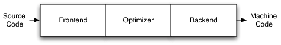

# LLVM cheatsheet
llvm工具链使用说明

## 编译器
最受欢迎的传统静态编译器设计主要是由三部分构成，分别是前端(front end)，优化器(optimizer)和后端(back end)。前端解析源码，检查语法错误，并生成语言特定的抽象语法树(AST)表示输入的代码。抽象语法树会被转换成一种新的中间展示(ir)，方便编译器进行优化。后端会根据目标机器生成最终的可以运行的二进制机器码。其示意图如下所示。

当编译器需要支持多种语言时，这种经典的解耦设计发挥了它最大的优势。如果编译器在优化器中使用一种通用的代码展示，那么只需写一个可以编译语言的前端，以及在不同平台写一个后端，提高了组件的通用性。其表示如下图所示：

LLVM项目是模块化和可重用的编译器及工具链技术的集合。名称``LLVM``是``Low Level Virtual Machine``的缩写，但是他现在和传统虚拟机并没有什么关系，只是``LLVM``的全名。LLVM最重要的设计时中间表示``LLVM Intermediate Representation(IR)``，它是编译器中表示代码的一种形式。优化器使用``LLVM IR``作中间的转换与分析处理。``LLVM IR``本身就是具有良好语义定义的一流语言。

``LLVM IR``是前端输出，后端的输入：


## Clang 编译过程
以一个``test.cpp``文件为例，代码如下：
```cpp
#include <stdio.h>

int main()
{
    printf("You are my sunshine");
}
```

可以通过以下命令，查看使用``clang``编译的几个不同阶段。
```bash
clang -ccc-print-phases test.c
```

其输出如下所示：
```bash
               +- 0: input, "test.cpp", c++
            +- 1: preprocessor, {0}, c++-cpp-output
         +- 2: compiler, {1}, ir
      +- 3: backend, {2}, assembler
   +- 4: assembler, {3}, object
+- 5: linker, {4}, image
6: bind-arch, "arm64", {5}, image
```
接下来，基于这个例子，通过使用``llvm``工具链，逐步完成整个编译过程。
### 预处理
基于输入，通过预处理执行一系列的文本转换与文本处理。预处理时在整整的编译开始之前由编译器调用的独立程序。
```bash
clang -E test.cpp -o test.i
```
其中命令``-E``表示运行预处理，``-o``后面跟输出文件名。下面是``test.ii``的片段
```c++
# 1 "test.cpp"
# 1 "<built-in>" 1
# 1 "<built-in>" 3
# 414 "<built-in>" 3
# 1 "<command line>" 1
# 1 "<built-in>" 2
# 1 "test.cpp" 2
# 1 "/Library/Developer/CommandLineTools/SDKs/MacOSX.sdk/usr/include/c++/v1/stdio.h" 1 3
# 101 "/Library/Developer/CommandLineTools/SDKs/MacOSX.sdk/usr/include/c++/v1/stdio.h" 3

···


extern "C" {
extern const int sys_nerr;
extern const char *const sys_errlist[];
int asprintf(char ** , const char * , ...) __attribute__((__format__ (__printf__, 2, 3)));
char *ctermid_r(char *);
char *fgetln(FILE *, size_t *);
const char *fmtcheck(const char *, const char *);
int fpurge(FILE *);
void setbuffer(FILE *, char *, int);
int setlinebuf(FILE *);
int vasprintf(char ** , const char * , va_list) __attribute__((__format__ (__printf__, 2, 0)));

FILE *funopen(const void *,
                 int (* _Nullable)(void *, char *, int),
                 int (* _Nullable)(void *, const char *, int),
                 fpos_t (* _Nullable)(void *, fpos_t, int),
                 int (* _Nullable)(void *));
}
# 108 "/Library/Developer/CommandLineTools/SDKs/MacOSX.sdk/usr/include/c++/v1/stdio.h" 2 3
# 2 "test.cpp" 2
int main()
{
    printf("You are my sunshine");
}
```
其中``.c``输出``.i``文件，``.cpp``输出``.ii``文件。

预处理的任务主要有以下几点：
- 将输入文件读到内存，并断行；
- 替换注释为单个空格；
- ``Tokenization``将输入转换为一系列预处理``Tokens``;
- 处理``#include``所引入的库，以递归的方式，插入到``#include``所在的位置;
- 替换宏定义;
- 条件编译，根据条件包括或者排除程序代码的某些部分;
- 插入行标记;

在预处理的输出中，源文件名和行号信息会以``# linenum filename flags``形式传递，这被称为行标记，代表接下来的内容开始于源文件``filename``的第``linenum``行，而``flags``则会有``0``或者多个，有``1``,``2``,``3``,``4``；如果有多个``flags``时，彼此使用分号隔开。详见[此处](http://tigcc.ticalc.org/doc/cpp.html#SEC41)。

每个标识的标识内容如下：

- ``1``表示一个新文件的开始
- ``2``表示返回文件（包含另一个文件后）
- ``3``表示以下文本来自系统头文件，因此应禁止某些警告
- ``4``表示应将以下文本视为包装在隐式``extern "c"``块中。

### 词法分析
词法分析属于预处理部分，词法分析的整个过程，主要是按照：标识符、数字、字符串文字、标点符号，将代码分成许多字符串序列，其中每个元素称之为``Token``，整个过程称为``Tokenization``。命令如下所示：
```bash
clang -fmodules -fsyntax-only -Xclang -dump-tokens test.cpp
```

其中每个选项的含义:
- ``-fmodules``：启用``modules``语言功能。关于``Modules``特性，详见[此处](https://clang.llvm.org/docs/Modules.html#introduction)，大意为使用``import``代替``include``，编译速度更快。
- ``-fsyntax-only``：运行预处理器，解析器和类型检查阶段。
- ``-Xclang <arg>``：传递参数到``clang``的编译器。
- ``-dump-tokens``：运行预处理器，转储``Token``的内部表示。
更多关于``Clang``参数的描述，详见[此处](https://gist.githubusercontent.com/masuidrive/5231110/raw/db6ddfb4fdad174f99cbfefd38367223d491ca18/gistfile1.txt)。

其输出片段如下：
```c++
comma ','               Loc=</Library/Developer/CommandLineTools/SDKs/MacOSX.sdk/usr/include/stdio.h:378:62>
identifier 'fpos_t'      [StartOfLine] [LeadingSpace]   Loc=</Library/Developer/CommandLineTools/SDKs/MacOSX.sdk/usr/include/stdio.h:379:18>
l_paren '('      [LeadingSpace] Loc=</Library/Developer/CommandLineTools/SDKs/MacOSX.sdk/usr/include/stdio.h:379:25>
star '*'                Loc=</Library/Developer/CommandLineTools/SDKs/MacOSX.sdk/usr/include/stdio.h:379:26>
_Nullable '_Nullable'    [LeadingSpace] Loc=</Library/Developer/CommandLineTools/SDKs/MacOSX.sdk/usr/include/stdio.h:379:28>
r_paren ')'             Loc=</Library/Developer/CommandLineTools/SDKs/MacOSX.sdk/usr/include/stdio.h:379:37>
l_paren '('             Loc=</Library/Developer/CommandLineTools/SDKs/MacOSX.sdk/usr/include/stdio.h:379:38>
void 'void'             Loc=</Library/Developer/CommandLineTools/SDKs/MacOSX.sdk/usr/include/stdio.h:379:39>
star '*'         [LeadingSpace] Loc=</Library/Developer/CommandLineTools/SDKs/MacOSX.sdk/usr/include/stdio.h:379:44>
comma ','               Loc=</Library/Developer/CommandLineTools/SDKs/MacOSX.sdk/usr/include/stdio.h:379:45>
identifier 'fpos_t'      [LeadingSpace] Loc=</Library/Developer/CommandLineTools/SDKs/MacOSX.sdk/usr/include/stdio.h:379:47>
comma ','               Loc=</Library/Developer/CommandLineTools/SDKs/MacOSX.sdk/usr/include/stdio.h:379:53>
int 'int'        [LeadingSpace] Loc=</Library/Developer/CommandLineTools/SDKs/MacOSX.sdk/usr/include/stdio.h:379:55>
r_paren ')'             Loc=</Library/Developer/CommandLineTools/SDKs/MacOSX.sdk/usr/include/stdio.h:379:58>
comma ','               Loc=</Library/Developer/CommandLineTools/SDKs/MacOSX.sdk/usr/include/stdio.h:379:59>
int 'int'        [StartOfLine] [LeadingSpace]   Loc=</Library/Developer/CommandLineTools/SDKs/MacOSX.sdk/usr/include/stdio.h:380:18>
l_paren '('      [LeadingSpace] Loc=</Library/Developer/CommandLineTools/SDKs/MacOSX.sdk/usr/include/stdio.h:380:22>
star '*'                Loc=</Library/Developer/CommandLineTools/SDKs/MacOSX.sdk/usr/include/stdio.h:380:23>
_Nullable '_Nullable'    [LeadingSpace] Loc=</Library/Developer/CommandLineTools/SDKs/MacOSX.sdk/usr/include/stdio.h:380:25>
r_paren ')'             Loc=</Library/Developer/CommandLineTools/SDKs/MacOSX.sdk/usr/include/stdio.h:380:34>
l_paren '('             Loc=</Library/Developer/CommandLineTools/SDKs/MacOSX.sdk/usr/include/stdio.h:380:35>
void 'void'             Loc=</Library/Developer/CommandLineTools/SDKs/MacOSX.sdk/usr/include/stdio.h:380:36>
star '*'         [LeadingSpace] Loc=</Library/Developer/CommandLineTools/SDKs/MacOSX.sdk/usr/include/stdio.h:380:41>
r_paren ')'             Loc=</Library/Developer/CommandLineTools/SDKs/MacOSX.sdk/usr/include/stdio.h:380:42>
r_paren ')'             Loc=</Library/Developer/CommandLineTools/SDKs/MacOSX.sdk/usr/include/stdio.h:380:43>
semi ';'                Loc=</Library/Developer/CommandLineTools/SDKs/MacOSX.sdk/usr/include/stdio.h:380:44>
r_brace '}'      [StartOfLine]  Loc=</Library/Developer/CommandLineTools/SDKs/MacOSX.sdk/usr/include/stdio.h:381:1 <Spelling=/Library/Developer/CommandLineTools/SDKs/MacOSX.sdk/usr/include/sys/cdefs.h:72:25>>
int 'int'        [StartOfLine]  Loc=<test.cpp:3:1>
identifier 'main'        [LeadingSpace] Loc=<test.cpp:3:5>
l_paren '('             Loc=<test.cpp:3:9>
r_paren ')'             Loc=<test.cpp:3:10>
l_brace '{'      [StartOfLine]  Loc=<test.cpp:4:1>
identifier 'printf'      [StartOfLine] [LeadingSpace]   Loc=<test.cpp:5:5>
l_paren '('             Loc=<test.cpp:5:11>
string_literal '"You are my sunshine"'          Loc=<test.cpp:5:12>
r_paren ')'             Loc=<test.cpp:5:33>
semi ';'                Loc=<test.cpp:5:34>
r_brace '}'      [StartOfLine]  Loc=<test.cpp:6:1>
eof ''          Loc=<test.cpp:6:2>
```
词法分析中``Token``包含信息（详情见[此处](https://bcain-llvm.readthedocs.io/projects/clang/en/latest/InternalsManual/#the-token-class)）：
- ``Source Location``：表示``Token``开始的位置，比如：``Loc=<test.cpp:3:5>``;
- ``Token Kind``：表示``Token``的类型，比如``identifier``、``numeric_constant``、``string_literal``；
- ``Flags``：词法分析器和处理器跟踪每个``Token``的基础，目前有四个``Flag``分别是：
  - ``StartOfLine``：表示这是每行开始的第一个``Token``；
  - ``LeadingSpace``：当通过宏扩展``Token``时，在``Token``之前有一个空格字符。该标志的定义是依据处理器的字符串话要求而进行的非常严格的定义。
  - ``DisableExtand``：该标志在预处理器内部使用，用来表示``identifier``令牌禁止宏扩展。
  - ``NeedsCleaning``：如果令牌的原始拼写包含三字符组或转义的换行符，则设置此标志。


## llvm 常用工具详解
对于常用工具链以及其常用参数的使用说明
### clang
**功能描述**: clang 是LLVM的编译器

**使用方法**: clang [options] file...

**OPTIONS**:
|参数|参数说明|
|---|---|
|-S|只运行preprocess以及compilation步骤，因此最终生成文本形式的llvm .ll|
|-c|只运行preprocess, compile和assemble步骤，最终生成二进制形式的llvm .bc|
|-emit-llvm|生成llvm ir而不是可执行的二进制文件|
| -o \<file\>|输出写入文件\<file\>|
|-g|加入debug信息，特别是在vscode中如果需要调试代码，需要在``args``中加入该选项|

### opt
**功能概述**: llvm .bc -> .bc 模块优化器以及分析打印

**使用方法**: opt [options] \<input bitcode file\>，好像也支持llvm .ll

**OPTIONS**: 
|参数|参数说明|
|---|---|
|--load-pass-plugin=\<string\>|从plugin library加载passes，通常为动态链接库 *.{so\|dylib}|
|--passes=\<string\>|需要运行的pass名称|
|-disable-output|不会生成优化后的llvm .bc|

### lli
**功能概述**: llvm interpreter & dynamic compiler

**使用方法**: lli [options] \<input bitcode\> \<program arguments\>...

**OPTIONS**:
|参数|参数说明|
|---|---|

## Reference
1. [The Architecture of Open Source Applications: LLVM](http://www.aosabook.org/en/llvm.html#footnote-1)
2. [编译器与Clang编译过程](http://events.jianshu.io/p/2da08634b53a)